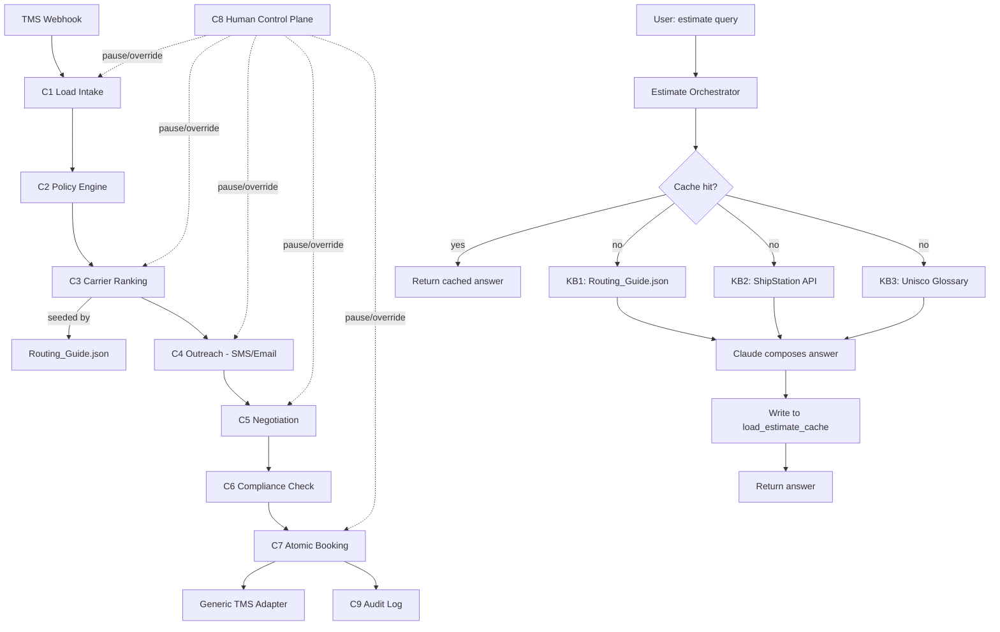

# MOTS ShipIt — Engineering Document

> Source PRD: `docs/MOTS ShipIt.docx_PRD_OLD.pdf` (24 pages; filename says "OLD" but this is the current, authoritative PRD).
> Status: Stage 1 output. Authoritative reference for all downstream stages — no implementation begins until this is approved.

---

## 1. Executive Summary

**Project name:** MOTS ShipIt

**Business goal:** Give U.S. freight brokerages an agentic workflow platform that sources, negotiates with, verifies, and books carriers for approved loads with minimal human touch — while preserving control, auditability, and fast exception recovery.

**Problem statement:** For every time-sensitive load, a broker must locate capacity, repeatedly contact carriers, interpret responses across noisy calls/messages, negotiate a viable rate, verify the carrier is legitimate and compliant, resolve exceptions, secure acceptance, and update the TMS. This is repetitive but not simple — context is scattered, terms are conversational, risk is asymmetric.

**Target users:**
- Supply Chain Strategic Operations Manager (Admin) — full authorized operational control
- Carrier Sales Representative — covers loads, protects margin
- Operations Manager — predictable coverage/service
- Compliance Specialist — prevents fraud/unsafe bookings
- Brokerage Customer / Shipper — reliable pickup at acceptable cost
- Carrier Dispatcher — clear load details, fast agreement

**Success criteria (from PRD):**
- North-star: ≥60% of eligible loads booked touchless by week 8 of pilot, 100% hard-gate compliance, no bypass of required checks
- Median time-to-cover: ≥50% faster than baseline
- Human minutes per eligible load: ≥65% reduction
- Booking accuracy: ≥99.5% (100% for critical fields)
- Compliance gate precision: ≥99%, zero known hard-gate bypasses

---

## 2. Product Scope

### In scope for MVP
- Dry van and reefer truckload, contiguous U.S.
- Repeat and approved carriers
- Business-hours + approved after-hours outreach
- **Load-estimate chatbot** (this engineering doc's first concretely-specced feature — see §10 Phase 1): user asks for a USD load estimate by zip/state; agent consults 3 knowledge sources (static routing/DIMs reference, live carrier rate API, logistics-terms glossary), returns an answer, caches it in Supabase for repeat queries on the same zip/state.
- Candidate carrier generation, parallel outreach (SMS/email first — see §8 and the Voice/Telephony decision below), negotiation within broker-defined guardrails, compliance/fraud verification, atomic booking, TMS write-back (generic adapter), exception queue with SLA countdowns, admin control plane, analytics.

### Out of scope for MVP
- Hazmat, oversize, cross-border customs, drayage, household goods, regulated special commodities
- Voice outreach (deferred — see Architecture Decisions; SMS/email first, voice is a pluggable channel added later once legal sign-off on AI voice disclosure/TCPA is complete)
- Autonomous shipper pricing, load creation, collections, claims adjudication, carrier payment
- Enterprise SSO/SAML (Supabase Auth email/password + OAuth for MVP; SSO is a later-phase upgrade)

### Future enhancements (Phase 2+)
- Voice/telephony outreach (Twilio or an all-in-one voice-AI platform, once legal/compliance sign-off exists)
- Concrete TMS integration (a real TMS replaces the generic adapter once a pilot customer/TMS is chosen — an open item in the PRD itself)
- Enterprise SSO/SAML
- Spanish-language conversations
- Automatic load recovery after carrier fall-off
- Reports sub-theme UI (see `docs/design.md`) for confidence/sensitivity/provenance visualizations

---

## 3. User Personas

| Persona | Role/Permissions | Primary workflows |
|---|---|---|
| **Admin** (Supply Chain Strategic Ops Manager) | Full authorized control: manage users/roles, configure broker/customer/lane/carrier/contact/integration settings, create/version policies, set rate/autonomy thresholds, start/pause/resume/reassign/approve/override/cancel workflows, manage exceptions, review conversations/evidence, reconcile bookings, access all reporting | Policy configuration, exception review, global pause/override, reporting |
| **Carrier Sales Rep** | Operate within assigned loads/lanes; review AI-suggested offers; approve/counter/reject at policy-defined thresholds | Review structured offers with evidence, approve/escalate exceptions |
| **Operations Manager** | Monitor coverage SLA, queue health, interventions | Dashboards, SLA monitoring |
| **Compliance Specialist** | Review compliance/fraud evidence; investigate flagged carriers | Compliance review queue, evidence bundle review |
| **Brokerage Customer / Shipper** (external, not a login role in MVP) | Receives booking confirmations/status | Notifications only — no direct console access in MVP |
| **Carrier Dispatcher** (external, contacted via SMS/email) | Responds to outreach, provides offers | No console access — interacts only via the outreach channel |

**Role model:** `admin`, `ops_manager`, `sales_rep`, `compliance` — enforced via Supabase Auth + RLS policies (see §7). External parties (carriers, shippers) are never authenticated console users in MVP; they're referenced as data (contacts, conversation participants).

---

## 4. User Flows

### 4.1 Load-estimate chatbot (Phase 1 — concretely specced first)

```
User Action                          → Frontend Behavior                     → Backend Processing                              → Database Interaction                      → System Response
Types "estimate for zip 30303"       → Submits query to chat input           → POST /api/estimate; parse zip/state from query  → SELECT from load_estimate_cache            → If cache hit: return cached answer immediately
                                                                                                                                   WHERE zip = '30303'                         (no KB calls)
                                                                              → On cache miss: call KB1 (Routing_Guide.json       → none yet                                  → Streams "checking knowledge bases..." status
                                                                                lookup), KB2 (ShipStation rate API),
                                                                                KB3 (Unisco Freight Glossary, for term
                                                                                validation on the query itself)
                                                                              → LLM (Claude) composes the answer from the        → INSERT/UPSERT into load_estimate_cache     → Renders answer card: carrier, corridor,
                                                                                3 KB results, with citations                      (zip, state, answer_json, sources, ts)      transit days, USD estimate, source citations
Asks the same zip again (next time)  → Submits query                         → Cache lookup only, no KB calls                   → SELECT from load_estimate_cache            → Instant cached answer
```

### 4.2 Load sourcing → booking (core platform, from the PRD's own "Happy-path workflow")

```
User Action                          → Frontend Behavior              → Backend Processing                                  → Database Interaction                        → System Response
TMS publishes sourcing-ready load    → (no direct user action;        → Orchestrator validates completeness, locks load    → INSERT load (version 1), policy snapshot    → Load appears in ops console "Sourcing" queue
                                        webhook-driven)                  version, applies policy
Admin reviews candidate carriers     → Views ranked candidate list    → Carrier Retrieval & Ranking (C3) scores carriers    → SELECT carriers, offers, compliance_snapshots → Ranked list with reason codes/exclusions
                                        with reason codes                using Routing_Guide.json-seeded lane data
(System) contacts carriers           → Ops console shows live         → Conversation Agents (C4) contact bounded batch      → INSERT interactions (conversation log)      → Live status per carrier (contacted, offer
                                        conversation status              via SMS/email (voice deferred)                                                                      received, no response)
(System) negotiates                  → Offers appear as they arrive   → Negotiation (C5) extracts offer + confidence,       → INSERT/UPDATE offers (offer ledger)          → Structured offer cards with evidence/confidence
                                        with confidence/evidence         negotiates within policy ceiling
(System) compliance check            → Compliance status badge        → Compliance & Fraud (C6) checks identity/authority/  → INSERT compliance_snapshots                 → Pass/block badge with evidence bundle
                                        updates                          insurance/fraud signals immediately pre-booking
Admin/system selects carrier         → "Book" action (manual in       → Selection & Booking (C7): final policy recheck,    → UPDATE bookings (atomic, idempotency key),  → Booking confirmed; other conversations closed;
                                        Assisted Booking phase;          atomic commit, one carrier per load version           UPDATE load status, INSERT audit_events       rate confirmation generated
                                        autonomous later)
System syncs to TMS                  → Status reflects "Synced"       → TMS adapter (generic interface) writes back         → UPDATE bookings.tms_sync_status             → Reconciliation status visible
Exception triggers (e.g. low         → Exception appears in queue     → Human Control Plane (C8) routes to queue with       → INSERT exceptions (with sla_deadline)       → Saffron/Red countdown badge per docs/design.md;
  confidence, rate-above-ceiling)      with Saffron SLA countdown        recommended action, risk, countdown                                                                 one-click approve/counter/reject
```

### 4.3 Admin control plane

```
User Action                → Frontend Behavior            → Backend Processing                        → Database Interaction              → System Response
Pause automation for a     → Clicks "Pause" at load/       → Writes a scoped pause record; all         → INSERT control_actions               → All affected workflows halt; audit trail entry
  customer/lane/globally     customer/lane/global level      in-flight agent actions at that scope                                              created
                                                              check this before acting
```

---

## 5. Frontend Architecture

**Stack:** Next.js 14, App Router, TypeScript (fixed — matches this project's `/frontend-setup` skill).

**UI library:** Design tokens from `docs/design.md` (MOTS ShipIt Design System — Blue primary, Inter Display + JetBrains Mono, Saffron SLA-urgency, optional Reports sub-theme for later analytics screens). Tailwind CSS mapped to those tokens (not arbitrary values — per the `/design-system` skill's rules).

**State management:** TanStack Query for server state (loads, offers, exceptions, cache hits) + React state for local UI (form inputs, modals). No global client state library needed at MVP scale — avoid introducing Redux/Zustand prematurely.

**Routing strategy:** App Router route groups:
- `(auth)` — login/signup (Supabase Auth)
- `(app)` — the authenticated ops console: dashboard, loads, exceptions, carriers, policies, reports, chat (load-estimate feature)

**UX states:**
- **Loading:** skeleton rows for tables; for the chatbot, a "checking knowledge bases..." status during a cache miss (per §4.1)
- **Empty:** "No loads need sourcing right now" / "No open exceptions" empty states
- **Error:** inline error banners distinguishing a KB/tool failure (fail-closed per PRD) from a user input error
- **Responsive:** ops console is desktop-first (data-dense tables); the chatbot view is usable at phone width per `docs/design.md`'s responsive rules
- **Accessibility:** WCAG AA minimum per `/design-system` skill — 4.5:1 contrast, visible focus states, keyboard navigation on every interactive element

**Page/component hierarchy (high level):**
```
app/
  (auth)/login, (auth)/signup
  (app)/dashboard          — coverage SLA, queue health (Operations Manager view)
  (app)/loads              — load list, load detail (candidates, offers, compliance)
  (app)/exceptions         — exception queue, SLA countdown badges
  (app)/carriers           — carrier directory, compliance snapshots
  (app)/policies           — policy configuration (Admin only)
  (app)/estimate           — the load-estimate chatbot (Phase 1 feature)
  (app)/reports            — analytics (stretch — Reports sub-theme)
```

---

## 6. Backend Architecture

**Stack:** Next.js API Routes (Node.js runtime) — consistent with the fixed frontend framework; no separate backend service for MVP.

**Core systems:**
- **Auth:** Supabase Auth (email/password + OAuth). `requireAuth()` helper (same pattern proven in the sibling ContractIQ build) wraps every API route.
- **Authorization:** Role column (`admin` / `ops_manager` / `sales_rep` / `compliance`) checked in-route + enforced independently via Supabase RLS (defense in depth, same pattern as ContractIQ's Stage 7 audit found effective).
- **Business logic:** mapped to the PRD's 9 components (C1–C9), each as a service module under `lib/freight/`:

| Component | Responsibility | Module |
|---|---|---|
| C1 | Load Intake & Context | `lib/freight/loadIntake.ts` |
| C2 | Policy & Eligibility | `lib/freight/policyEngine.ts` |
| C3 | Carrier Retrieval & Ranking | `lib/freight/carrierRanking.ts` (seeded by `Routing_Guide.json`) |
| C4 | Conversation Agents | `lib/freight/outreach.ts` (SMS/email channel interface; voice is a future pluggable channel) |
| C5 | Negotiation | `lib/freight/negotiation.ts` |
| C6 | Compliance & Fraud | `lib/freight/compliance.ts` |
| C7 | Selection & Booking | `lib/freight/booking.ts` (atomic, idempotency key) |
| C8 | Human Control Plane | `lib/freight/controlPlane.ts` |
| C9 | Observability & Learning | `lib/freight/audit.ts` |

- **Load-estimate chatbot** gets its own module, `lib/estimate/`, since it's a distinct feature with its own 3-KB flow (not one of C1–C9):

| Module | Responsibility |
|---|---|
| `lib/estimate/cache.ts` | Supabase cache read/write (`load_estimate_cache` table) |
| `lib/estimate/routingGuide.ts` | KB1 — loads and queries `Routing_Guide.json` |
| `lib/estimate/shipstation.ts` | KB2 — calls ShipStation Rates API (free tier) |
| `lib/estimate/glossary.ts` | KB3 — queries the Unisco Freight Glossary for term validation |
| `lib/estimate/orchestrator.ts` | Combines KB1+KB2+KB3 results, calls the LLM to compose the final answer |

- **Validation:** centralized Zod schemas per route (inline per-route, not a premature re-export indirection — per the ContractIQ playbook's lesson, item 13)
- **Middleware:** `middleware.ts` — redirect unauthenticated users away from `(app)` routes; redirect already-authenticated users away from `(auth)` routes
- **Error handling:** fail-closed for anything in the booking/compliance path (per PRD); user-facing errors never leak stack traces or internal tool errors

**Service interaction diagram:**



---

## 7. Database Design and Schema

Supabase (PostgreSQL + Auth + Storage + RLS). **New Supabase project** for MOTS ShipIt (not shared with the sibling ContractIQ project) — to be created when the user is ready, per their own direction.

### `profiles`
| Column | Type | Notes |
|---|---|---|
| id | uuid PK, FK → auth.users | |
| role | text | `admin` \| `ops_manager` \| `sales_rep` \| `compliance` |
| full_name | text | |
| created_at | timestamptz | default now() |

### `loads`
| Column | Type | Notes |
|---|---|---|
| id | uuid PK | |
| version | int | incremented on every material change; locked during active negotiation |
| lane_origin_zip | text | |
| lane_dest_zip | text | |
| equipment_type | text | `dry_van` \| `reefer` |
| schedule_pickup | timestamptz | |
| schedule_delivery | timestamptz | |
| commodity | text | |
| weight_lbs | numeric | |
| customer_id | uuid FK → customers | |
| target_rate | numeric | |
| rate_ceiling | numeric | confidential — never exposed to carrier-facing responses |
| status | text | `sourcing` \| `negotiating` \| `booked` \| `exception` \| `cancelled` |
| created_at | timestamptz | |

### `customers`
| id uuid PK | name text | policy_id uuid FK → policies | rate_authority jsonb |

### `policies`
| id uuid PK | customer_id FK | version int | eligible_lanes jsonb | eligible_equipment jsonb | carrier_tiers jsonb | rate_bounds jsonb | concession_rules jsonb | approval_thresholds jsonb | effective_at timestamptz | approved_by uuid FK → profiles |

### `carriers`
| id uuid PK | legal_name text | usdot text | mc_number text | tier text | lanes jsonb | equipment jsonb | contact_preferences jsonb | service_history jsonb |

### `carrier_contacts`
| id uuid PK | carrier_id FK | name text | phone text | email text | authority_verified boolean | opt_out boolean |

### `compliance_snapshots`
| id uuid PK | carrier_id FK | checked_at timestamptz | authority_status text | insurance_status text | safety_status text | fraud_risk_score numeric | evidence jsonb | source text |

### `offers` (negotiation ledger)
| id uuid PK | load_id FK | load_version int | carrier_id FK | rate numeric | terms jsonb | confidence numeric | evidence jsonb | status text (`proposed`\|`countered`\|`accepted`\|`expired`\|`rejected`) | created_at timestamptz |

### `bookings`
| id uuid PK | load_id FK | load_version int | carrier_id FK | offer_id FK | idempotency_key text UNIQUE | rate_confirmation_url text | tms_sync_status text | booked_at timestamptz |

### `interactions` (conversation log)
| id uuid PK | load_id FK | carrier_id FK | channel text (`sms`\|`email`\|`voice` [future]) | transcript jsonb | disclosures jsonb | opt_out boolean | created_at timestamptz |

### `exceptions`
| id uuid PK | load_id FK | trigger_type text | recommended_action text | risk_level text | sla_deadline timestamptz | status text (`open`\|`resolved`\|`breached`) | resolved_by uuid FK → profiles | resolution text |

### `control_actions` (C8 audit)
| id uuid PK | actor_id FK → profiles | scope text (`load`\|`customer`\|`lane`\|`agent`\|`channel`\|`global`) | scope_id text | action text (`pause`\|`resume`\|`override`\|`cancel`) | reason text | created_at timestamptz |

### `audit_events` (C9, immutable)
| id uuid PK | entity_type text | entity_id uuid | event_type text | payload jsonb | model_version text | policy_version int | created_at timestamptz |

### `load_estimate_cache` (load-estimate chatbot — **the only table this feature needs beyond `profiles`**)
| Column | Type | Notes |
|---|---|---|
| id | uuid PK | |
| zip_or_state | text | the cache key — a US zip code or state code |
| query_type | text | `transit_time` \| `cost` \| `both` |
| answer_json | jsonb | the composed answer (carrier, corridor, transit days, USD estimate) |
| sources | jsonb | citations from KB1/KB2/KB3 used to build the answer |
| created_at | timestamptz | |
| UNIQUE(zip_or_state, query_type) | | one cached answer per key+type, per the user's "first answer wins" cache design |

**Relationships:** `loads` 1—N `offers`, `offers` N—1 `carriers`, `bookings` 1—1 `offers` (one booking per accepted offer), `exceptions` N—1 `loads`, `interactions` N—1 `loads` + N—1 `carriers`.

**Indexes:** `loads(status)`, `offers(load_id, load_version)`, `exceptions(sla_deadline)` (for the countdown queue), `load_estimate_cache(zip_or_state, query_type)` (the cache lookup path).

**RLS:** own-customer-data-only for `loads`/`offers`/`bookings` scoped by role; `admin` role bypasses scoping; `load_estimate_cache` is readable by any authenticated user (no customer-scoping — it's a shared reference cache, not customer data).

---

## 8. AI Architecture

**LLM provider:** OpenAI (changed from Anthropic Claude on 2026-10-08 at the user's request, reusing the ContractIQ project's OpenAI account). The load-estimate chatbot uses `OPENAI_MODEL` (default `gpt-4o-mini`) only to word the answer; every number is computed in code. Original plan, still applicable to later features with OpenAI models: model cascade — a larger/more capable model for negotiation (FR-08), critical term extraction (FR-07), and composing the load-estimate chatbot's answer across 3 KBs (tool-calling); a smaller/faster model for summarization and exception classification. Exact model versions chosen at implementation time (pick current models, not hardcoded here, so this doc doesn't go stale).

**Prompt strategy (per the PRD's own explicit guidance):**
- Separate prompts by role: conversation, extraction, exception classification, summary, estimate-composition — never one general-purpose prompt for the whole workflow
- Inject the minimum necessary context; retrieve customer-approved definitions/playbooks with source IDs and effective dates
- Schema-constrained JSON output with explicit confidence, evidence spans, and an "unknown" state — reject malformed/unsupported outputs
- The agent cannot claim completion until a deterministic tool call returns success (no LLM-only "I did it")
- Negotiation constrained through tools (`propose_offer(amount, terms)` validates permissions/ceiling server-side) — the prompt never receives the confidential rate ceiling with needless precision
- **Prompt injection defense:** carrier conversation content and KB content (especially KB2/ShipStation API responses and KB3/glossary text) are treated as untrusted data — instructions never come from inside a tool result or a carrier message

**Context/memory:** per-conversation context scoped to the active load + relevant policy + carrier history. The load-estimate chatbot's context is scoped per-query (no multi-turn memory needed for a single estimate lookup in MVP).

**The 3-KB load-estimate chatbot's tool-calling architecture:**
1. `check_cache(zip_or_state)` → `lib/estimate/cache.ts` — tried first, always
2. `lookup_routing_guide(zip_or_state)` → `lib/estimate/routingGuide.ts` — KB1, static
3. `get_shipstation_rate(address, weight, dims)` → `lib/estimate/shipstation.ts` — KB2, live API call
4. `lookup_glossary_term(term)` → `lib/estimate/glossary.ts` — KB3, used to validate/interpret ambiguous terms in the user's query
5. Claude composes the final answer from tool results, with citations, then the orchestrator writes the result to `load_estimate_cache`

**Token limits:** chat history capped (env-overridable, matching the pattern proven in ContractIQ — e.g. `MAX_CHAT_HISTORY`); estimate queries are single-turn, no large context needed.

**Rate limiting:** per the security-foundation pattern already proven in the sibling ContractIQ build — sliding-window limits per endpoint (auth, chat/estimate, booking-affecting actions), keyed by a generic identifier column (`user:<uuid>` post-auth or `ip:<address>` pre-auth) — **not** a strict `user_id` foreign key, because the most important case to rate-limit (brute-force login) has no `user_id` yet. This is a direct, deliberate carry-over from a real bug the ContractIQ build caught and fixed before shipping.

**Cost controls:** model cascade (above); ShipStation free tier for KB2 (confirmed sufficient — no paid tier needed at MVP volume); Unisco Freight Glossary is free/unlimited for KB3.

**Fallback:** if ShipStation (KB2) is unavailable, the estimate chatbot falls back to a transit-time-only answer from Routing_Guide.json (KB1) alone, with a clear "cost estimate unavailable" note — never a guessed dollar figure. This mirrors the PRD's own fail-closed principle for the booking path.

---

## 9. API Specification

### Load-estimate chatbot

| Method | Path | Purpose | Auth | Request | Response | Validation | Errors |
|---|---|---|---|---|---|---|---|
| POST | `/api/estimate` | Get a load estimate for a zip/state | Required (any role) | `{ query: string }` (free text; zip/state parsed server-side) | `{ cached: boolean, answer: {...}, sources: [...] }` | zip/state extracted and validated against US formats | 400 invalid input, 502 KB2 unavailable (falls back, doesn't error), 500 unexpected |
| GET | `/api/estimate/history` | List recent estimate queries (own user) | Required | — | `{ items: [...] }` | — | 401 unauthenticated |

### Core platform (C1–C9)

| Method | Path | Purpose | Auth | Request | Response | Validation | Errors |
|---|---|---|---|---|---|---|---|
| POST | `/api/loads/webhook` | TMS load intake (C1) | Service-to-service (webhook secret, not user auth) | TMS load payload | `{ load_id, version }` | required fields per schema | 400 incomplete load, 401 bad webhook secret |
| GET | `/api/loads` | List loads (scoped by role) | Required | query params: status, customer | `{ items: [...] }` | — | 401 |
| GET | `/api/loads/:id/candidates` | Ranked carrier candidates (C3) | Required | — | `{ candidates: [{ carrier, score, reason_codes }] }` | — | 404 load not found |
| POST | `/api/loads/:id/outreach` | Trigger bounded-batch outreach (C4) | Required (`admin`\|`sales_rep`) | `{ batch_size }` | `{ contacted: [...] }` | respects frequency caps/opt-outs | 409 load already booked |
| POST | `/api/offers/:id/respond` | Approve/counter/reject an offer (C5) | Required | `{ action, counter_terms? }` | `{ offer, status }` | within policy bounds | 403 outside approval authority |
| GET | `/api/carriers/:id/compliance` | Latest compliance snapshot (C6) | Required | — | `{ snapshot }` | freshness-checked | 409 stale/unavailable (fail-closed) |
| POST | `/api/loads/:id/book` | Atomic booking (C7) | Required (`admin`\|`sales_rep`) | `{ offer_id, idempotency_key }` | `{ booking }` | final policy recheck server-side | 409 already booked (idempotent) |
| POST | `/api/control/pause` | Pause at a scope (C8) | Required (`admin`) | `{ scope, scope_id, reason }` | `{ control_action }` | — | 403 non-admin |
| GET | `/api/exceptions` | Exception queue with SLA countdowns | Required | — | `{ items: [{ ..., sla_deadline }] }` | — | — |
| POST | `/api/exceptions/:id/resolve` | Resolve an exception | Required | `{ action, resolution }` | `{ exception }` | — | 404 |

All routes wrapped in `requireAuth()`; all mutating routes validated against centralized Zod schemas; all booking/compliance-path routes fail closed on any upstream tool failure.

---

## 10. Feature Breakdown

### Phase 1 (MVP — build this first)
1. **Load-estimate chatbot** (3-KB design, Supabase cache) — acceptance: a zip/state query returns a cached-or-fresh USD estimate with citations; repeat queries hit cache.
   - Dependencies: `Routing_Guide.json` (already in repo), ShipStation free-tier account, Unisco Freight Glossary (no account needed)
2. **Load intake + policy engine (C1/C2)** — acceptance: a TMS-shaped load payload is validated, versioned, and policy-evaluated.
3. **Carrier ranking (C3)**, seeded by `Routing_Guide.json` — acceptance: a ranked candidate list with reason codes.
4. **SMS/email outreach (C4)** — acceptance: bounded-batch outreach respecting frequency caps/opt-outs.
5. **Negotiation (C5) + compliance (C6)** — acceptance: structured offers with confidence/evidence; compliance pass/block with evidence bundle.
6. **Atomic booking (C7) + generic TMS adapter** — acceptance: exactly one booking per load version, idempotent.
7. **Exception queue + admin control plane (C8)** — acceptance: SLA-countdown queue, scoped pause/override.
8. **Audit log (C9)** — acceptance: every decision traceable.

### Phase 2
- Voice/telephony channel (once legal sign-off exists)
- Real TMS integration (replacing the generic adapter)
- Enterprise SSO/SAML
- Automatic load recovery after carrier fall-off
- Spanish-language support

### Phase 3
- Reports sub-theme UI (confidence/sensitivity/provenance visualizations per `docs/design.md`)
- Multi-lane/multi-customer scale-up, advanced ranking model improvements

---

## 11. Folder Structure

```
Gen-AI-Apps_MOTS-ShipIt/
├── mots-shipit-ai/               # Next.js app — own subfolder, mirrors sibling ContractIQ (`contractiq/`)
│   ├── app/                      # App Router — no src/ wrapper
│   │   ├── (auth)/
│   │   │   ├── login/
│   │   │   └── signup/
│   │   ├── (app)/
│   │   │   ├── dashboard/
│   │   │   ├── loads/[id]/
│   │   │   ├── exceptions/
│   │   │   ├── carriers/
│   │   │   ├── policies/
│   │   │   ├── estimate/         # load-estimate chatbot UI
│   │   │   └── reports/          # stretch — Reports sub-theme
│   │   └── api/
│   │       ├── estimate/
│   │       ├── loads/
│   │       ├── offers/
│   │       ├── carriers/
│   │       ├── control/
│   │       └── exceptions/
│   ├── components/
│   │   ├── providers/            # QueryProvider (TanStack Query)
│   │   └── ui/                   # Button, Card, Badge, Input — design.md tokens
│   ├── lib/
│   │   ├── supabase/             # client / server / admin Supabase helpers
│   │   ├── security/             # authGuard, rateLimiter, promptInjectionGuard, inputValidator
│   │   ├── ai/                   # Claude client, prompt templates per role
│   │   ├── freight/              # C1-C9 service modules
│   │   ├── estimate/             # cache, routingGuide, shipstation, glossary, orchestrator
│   │   ├── hooks/
│   │   └── utils/
│   ├── types/                    # database.ts (generated Supabase types)
│   ├── data/
│   │   └── Routing_Guide.json    # KB1 — inside the app so the Netlify build (base = mots-shipit-ai) bundles it
│   ├── specs/                    # Stage 2 granular specs + supabase-schema.sql
│   ├── supabase/
│   │   └── rls-policies.sql      # Stage 7
│   ├── middleware.ts
│   ├── tailwind.config.ts        # design.md tokens
│   └── .env.local / .env.local.example
├── docs/
│   ├── engineering/              # this file + implementation-specs.md (Stage 1)
│   ├── security/                 # Stage 7 security plan
│   ├── design.md
│   ├── notes/                    # gitignored — mirrored project memory
│   └── MOTS ShipIt.docx_PRD_OLD.pdf
├── test/                         # Stage 5 — Vitest + Playwright (root, as in ContractIQ)
└── netlify.toml                  # base = "mots-shipit-ai"
```

---

## 12. Naming Conventions

| Category | Convention | Example |
|---|---|---|
| Files (components) | PascalCase | `ExceptionQueue.tsx` |
| Files (utilities/lib) | camelCase | `carrierRanking.ts` |
| Folders | kebab-case | `app/(app)/loads/` |
| React components | PascalCase | `LoadCandidateCard` |
| Hooks | `use` + camelCase | `useEstimateQuery` |
| API routes | REST nouns, plural | `/api/loads`, `/api/exceptions` |
| DB tables | snake_case, plural | `load_estimate_cache` |
| DB columns | snake_case | `sla_deadline` |
| Env vars | SCREAMING_SNAKE_CASE | `SHIPSTATION_API_KEY` |
| Config files | kebab-case | `netlify.toml` |

---

## 13. Testing Strategy

**Unit:** business logic in `lib/freight/*` and `lib/estimate/*` (policy evaluation, ranking scoring, cache key logic) — Vitest. Target: ≥80% coverage on `lib/freight/` and `lib/estimate/`.

**Integration:** API routes against a test Supabase instance — auth, RLS enforcement, atomic booking idempotency (concurrent-request test per PRD's own "zero double bookings" requirement), estimate cache hit/miss behavior. Vitest + Supabase local dev.

**E2E:** critical user flows — Playwright:
- Login → view exception queue → resolve an exception
- Submit an estimate query → see cached result on repeat query
- Load intake → candidate ranking → outreach → offer → booking (happy path, mocked outreach channel)

**Per the PRD's own evaluation strategy (carry into test design, not just unit tests):** critical-field extraction accuracy, policy decision agreement, compliance decision recall — these need curated fixture data (sample loads, sample carrier offers), not just mocked happy-path tests.

---

## 14. Specs to Implementation Mapping

| Spec area | Implementation files | Flow |
|---|---|---|
| Load-estimate chatbot | `app/(app)/estimate/`, `app/api/estimate/`, `lib/estimate/*` | User query → cache check → KB1+KB2+KB3 → Claude composes answer → cache write → response |
| Load intake (C1) | `app/api/loads/webhook/`, `lib/freight/loadIntake.ts` | TMS webhook → validate → version → policy snapshot |
| Carrier ranking (C3) | `app/api/loads/[id]/candidates/`, `lib/freight/carrierRanking.ts` | Load → policy-filtered carrier pool → scored by `Routing_Guide.json`-seeded lane data |
| Outreach (C4) | `app/api/loads/[id]/outreach/`, `lib/freight/outreach.ts` | Bounded batch → SMS/email channel → interaction log |
| Negotiation + Compliance (C5/C6) | `app/api/offers/[id]/respond/`, `lib/freight/negotiation.ts`, `lib/freight/compliance.ts` | Offer extraction → policy-bounded negotiation → compliance recheck |
| Booking (C7) | `app/api/loads/[id]/book/`, `lib/freight/booking.ts` | Final recheck → atomic commit → TMS write-back |
| Control plane (C8) | `app/api/control/pause/`, `lib/freight/controlPlane.ts` | Scoped pause/override → halts in-flight actions at that scope |
| Audit (C9) | `lib/freight/audit.ts` | Every state transition → `audit_events` |

---

## Architecture Decisions (resolved via `AskUserQuestion`, 2026-10-08)

| Decision | Choice | Rationale |
|---|---|---|
| Database | Supabase (new project, created when user is ready) | Fixed by this framework's tooling (RLS/SQL generation) |
| Auth | Supabase Auth | Pairs natively with Supabase; SSO deferred to later phase |
| LLM provider | OpenAI (was Anthropic Claude; changed 2026-10-08 by the user) | Reuses the ContractIQ project's OpenAI account |
| Voice/telephony | Deferred for MVP — pluggable channel interface | Matches PRD's phased rollout (shadow mode = 0% live voice); avoids vendor lock-in before legal sign-off |
| TMS integration | Generic adapter interface | PRD itself lists "which TMS" as an unresolved open question |
| Hosting | Netlify (new site, separate from the sibling ContractIQ project's site) | User's own direction; matches the proven playbook from the sibling build |

## Open Items (carried forward, not blocking Stage 1 approval)
1. Exact ShipStation account/API key setup — pending user action
2. New Supabase project creation — pending user action ("I will help you when we come to that")
3. New Netlify site name — pending user decision
4. Real TMS selection — explicitly unresolved in the PRD itself, generic adapter stands in until then
5. Legal/compliance sign-off on AI disclosure, call recording, TCPA — blocking voice (Phase 2), not MVP
